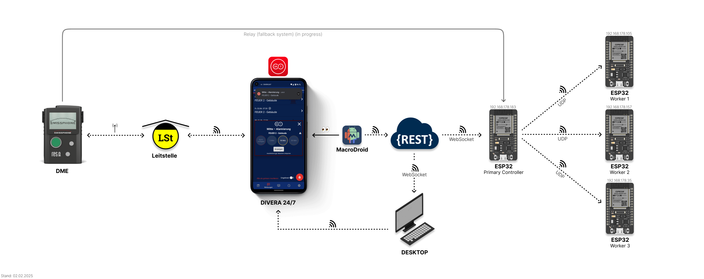
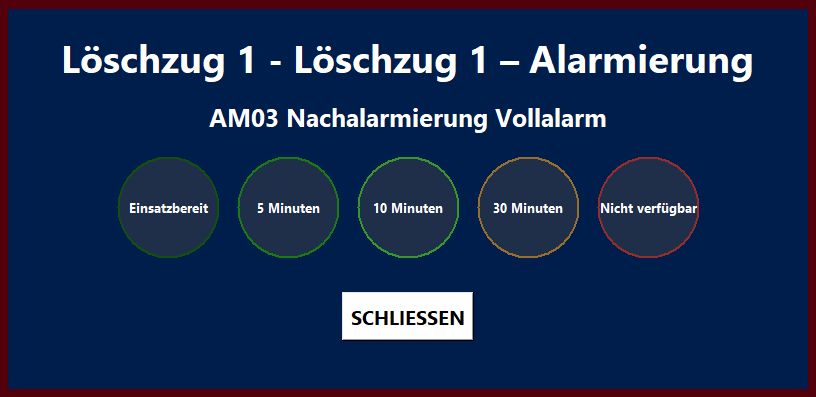
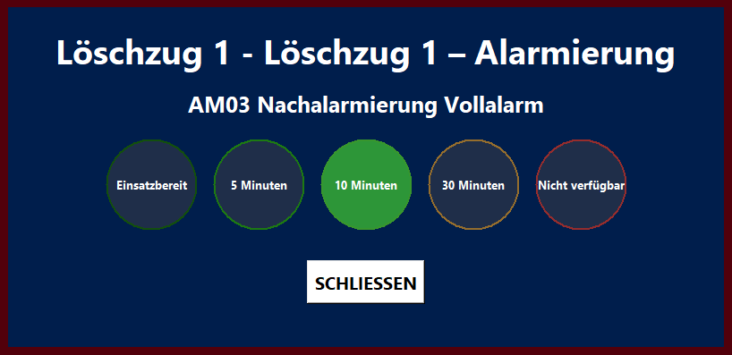

The ESP32 workers are connected to LED strips and light up white after corresponding commands and flash depending on the keyword.

## Desktop
The overlay is placed over all applications, even if a video (e.g. YouTube) or something else is played in the original format, and cannot be placed under other applications.

